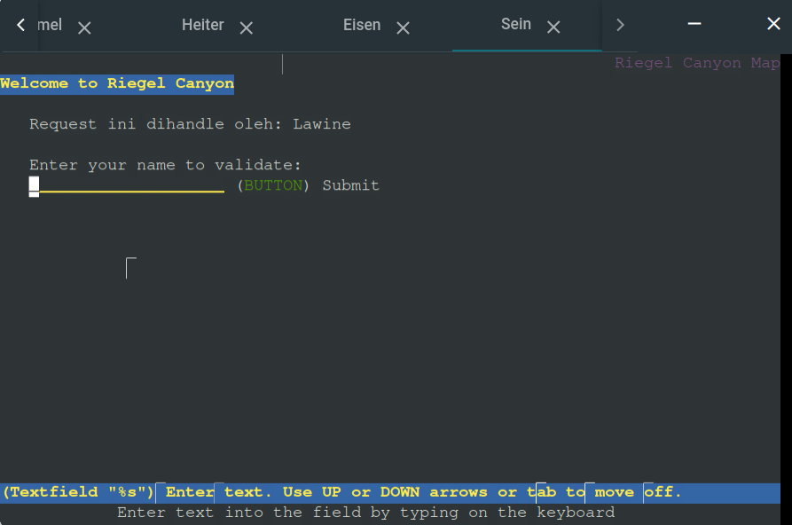

# Jarkom-Modul-3-B20-2023

## Informasi Kelompok

| Nama | NRP |
| ---- | --- |
| Richie Seputro | 5025211213 |
| Dimas Aria Pujangga | 5025211212 |

## Topologi


0. Dimas

1. Dimas

2. Dimas

3. Dimas

4. Dimas

5. Dimas

6. Dimas

7. Dimas

8. Penjelasan untuk soal nomor 8 ada pada Grimoire pada link berikut:
   [Grimoire B20](https://docs.google.com/document/d/1nBn-T3pYLUuw57cAKFyD8BxiqECJ8dVF7kLpJApF_To/edit?usp=sharing)

9. Penjelasan untuk soal nomor 9 ada pada Grimoire pada link berikut:
   [Grimoire B20](https://docs.google.com/document/d/1nBn-T3pYLUuw57cAKFyD8BxiqECJ8dVF7kLpJApF_To/edit?usp=sharing)

10. Pertama, kita buat dulu folder `/etc/nginx/rahasisakita` dengan command `mkdir /etc/nginx/rahasisakita`.
    Lalu, lakukan command `htpasswd -cb /etc/nginx/rahasisakita/.htpasswd netics ajkb20` untuk membuat file autentikasi.
    Lalu, tambahkan baris-baris berikut ke *vhost* file dari `nginx` pada `/etc/nginx/sites-available/default`:
    ```
    location / {
        auth_basic "Frieren Private Club";
        auth_basic_user_file /etc/nginx/rahasisakita/.htpasswd;
    }
    ```
    Selanjutnya, akses laman website yang disediakan oleh load balancer Eisen dengan `lynx`:

    

    

    

      
    
    

11. Pertama, tambahkan baris-baris berikut ke file `/etc/nginx/sites-available/default`:
    ```
    location ~ (.*)+/its(.*)+ {
        proxy_pass http://www.its.ac.id;
    }
    ```
    Jika kita melakukan request ke website dengan URL yang mengandung "/its" maka akan di-redirect ke laman milik ITS:

    
    
    
    
    

12. Pertama, tambahkan konfigurasi berikut ke `/etc/nginx/sites-available/default`:

    

    Selanjutnya, kita cek dulu IP address dari salah satu client dari masing-masing subnet x.x.3.x yaitu Revolte dan untuk subnet x.x.4.x yaitu Sein. Dicontohkan di sini menggunakan client Sein (untuk client Revolte juga sama persis langkah-langkahnya).

    
    
    Lalu, kita coba untuk akses Load Balancer dengan IP address Sein yang bukan merupakan IP address yang di-whitelist.
    
    
    
    
    
    Terlihat bahwa client Sein dilarang mengakses website.
    
    Ubah dulu IP address dari Sein menjadi IP address statik yang sudah di-whitelist.
    
    
    
    Coba ulang mengunjungi website.

    
    
    
    
    Terlihat bahwa Sein telah diperbolehkan untuk mengakses website.

    Ulangi langkah-langkah di atas untuk client Revolte.

13. Pertama, tambahkan command berikut ke `/root/.bashrc` atau jalankan secara manual di host Denken:

    
    
    Jangan lupa ubah bind-address dari server MariaDB ke `0.0.0.0` di file `/etc/mysql/mariadb.conf.d/50-server.cnf`.

    Setelah itu buatlah database dan user-user yang akan digunakan oleh worker Laravel dengan menjalankan perintah-perintah berikut di host Denken:

    ```
    mysql -u root -p
    Enter password: <masukkan password>

    CREATE USER 'kelompokb20'@'%' IDENTIFIED BY 'passwordb20';
    CREATE USER 'kelompokb20'@'localhost' IDENTIFIED BY 'passwordb20';
    CREATE DATABASE dbkelompokb20;
    GRANT ALL PRIVILEGES ON *.* TO 'kelompokb20'@'%';
    GRANT ALL PRIVILEGES ON *.* TO 'kelompokb20'@'localhost';
    ```
    
    Kemudian lakukan restart service MariaDB dengan `service mysql restart`.
    
    Terakhir, cek dari worker Laravel apakah bisa meng-issue command ke database di Denken.
    
    
    
    Terlihat bahwa Denken dapat diakses di Fern.

14. Kelompok kami mengalami kendala di nomor ini yang mengakibatkan kami tidak bisa lanjut mengerjakan nomor-nomor selanjutnya. Berikut penjelasannya:

    Pertama, jalankan command atau tambahkan command ke `/root/.bashrc` dari masing-masing worker Laravel yaitu Fern, Flamme, dan Frieren sebagai berikut:

    
    
    Namun, terjadi error di ketiga worker Laravel tersebut di bagian `composer install`. Berikut error message dari masing masing worker:

    Fern:

    
    
    Flamme:

    
    
    Frieren:

    
    
    Hal ini mengakibatkan Laravel project tidak dapat di-install sama sekali dan menjadi kendala kelompok kami.

15. Terkendala nomor 14.

16. Terkendala nomor 14.

17. Terkendala nomor 14.

18. Terkendala nomor 14.

19. Terkendala nomor 14.

20. Terkendala nomor 14.
