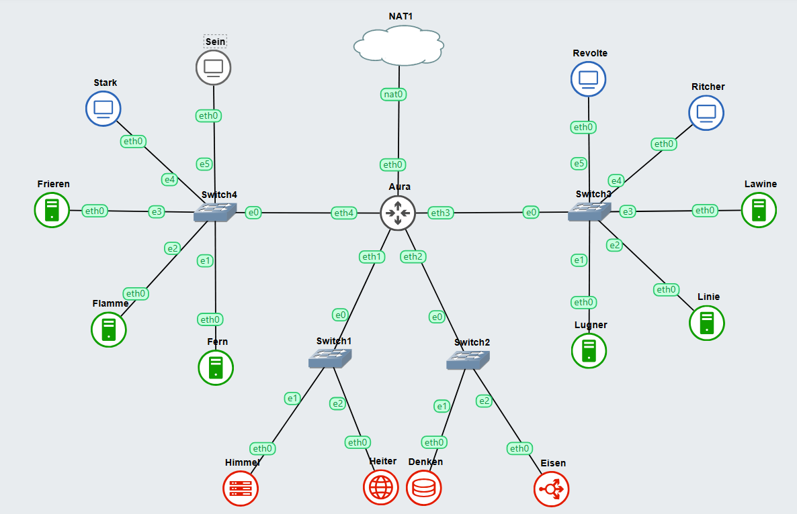

# Jarkom-Modul-3-B20-2023

## Informasi Kelompok

| Nama | NRP |
| ---- | --- |
| Richie Seputro | 5025211213 |
| Dimas Aria Pujangga | 5025211212 |

## Topologi


## Config
- **Aura (DHCP Relay)**
```
auto eth0
iface eth0 inet dhcp

auto eth1
iface eth1 inet static
	address 192.188.1.0
	netmask 255.255.255.0

auto eth2
iface eth2 inet static
	address 192.188.2.0
	netmask 255.255.255.0

auto eth3
iface eth3 inet static
	address 192.188.3.0
	netmask 255.255.255.0

auto eth4
iface eth4 inet static
	address 192.188.4.0
	netmask 255.255.255.0

```
- **Himmel (DHCP Server)**
```
auto eth0
iface eth0 inet static
	address 192.188.1.1
	netmask 255.255.255.0
	gateway 192.188.1.0

```
- **Heiter (DNS Server)**
```
auto eth0
iface eth0 inet static
	address 192.188.1.2
	netmask 255.255.255.0
	gateway 192.188.1.0
```
- **Denken (Database Server)**
```
auto eth0
iface eth0 inet static
	address 192.188.2.1
	netmask 255.255.255.0
	gateway 192.188.2.0
```
- **Eisen (Load Balancer)**
```
auto eth0
iface eth0 inet static
	address 192.188.2.2
	netmask 255.255.255.0
	gateway 192.188.2.0
```
- **Frieren (Laravel Worker)**
```
auto eth0
iface eth0 inet static
	address 192.18.4.3
	netmask 255.255.255.0
	gateway 192.188.4.0
```
- **Flamme (Laravel Worker)**
```
auto eth0
iface eth0 inet static
	address 192.188.4.2
	netmask 255.255.255.0
	gateway 192.188.4.0
```
- **Fern (Laravel Worker)**
```
auto eth0
iface eth0 inet static
	address 192.188.4.1
	netmask 255.255.255.0
	gateway 192.188.4.0
```
- **Lawine (PHP Worker)**
```
auto eth0
iface eth0 inet static
	address 192.188.3.3
	netmask 255.255.255.0
	gateway 192.188.3.0
```
- **Linie (PHP Worker)**
```
auto eth0
iface eth0 inet static
	address 192.188.3.2
	netmask 255.255.255.0
	gateway 192.188.3.0
```
- **Lugner (PHP Worker)**
```
auto eth0
iface eth0 inet static
	address 192.188.3.1
	netmask 255.255.255.0
	gateway 192.188.3.0
```
- **Revolte, Richter, Sein, dan Stark (Client)**
```
auto eth0
iface eth0 inet dhcp
```

## Soal 1 
>Lakukan konfigurasi sesuai dengan peta yang sudah diberikan.

- **Lugner (PHP Worker)**
```
auto eth0
iface eth0 inet static
	address 192.188.3.1
	netmask 255.255.255.0
	gateway 192.188.3.0
```
- **Fern (Laravel Worker)**
```
auto eth0
iface eth0 inet static
	address 192.188.4.1
	netmask 255.255.255.0
	gateway 192.188.4.0
```

Selanjutnya pada DNS Server (Heiter), kita perlu menjalankan command dibawah ini

### Script
```
echo 'zone "riegel.canyon.b20.com" {
    type master;
    file "/etc/bind/sites/riegel.canyon.b20.com";
};

zone "granz.channel.b20.com" {
    type master;
    file "/etc/bind/sites/granz.channel.b20.com";
};

zone "1.188.192.in-addr.arpa" {
    type master;
    file "/etc/bind/sites/1.188.192.in-addr.arpa";
};' > /etc/bind/named.conf.local
```

```
;
; BIND data file for local loopback interface
;
$TTL    604800
@       IN      SOA     riegel.canyon.b20.com. root.riegel.canyon.b20.com. (
                        2023111401      ; Serial
                         604800         ; Refresh
                          86400         ; Retry
                        2419200         ; Expire
                         604800 )       ; Negative Cache TTL
;
@       IN      NS      riegel.canyon.b20.com.
@       IN      A       192.188.4.1     ; IP Fern


; BIND data file for local loopback interface
;
$TTL    604800
@       IN      SOA     granz.channel.b20.com. root.granz.channel.b20.com. (
                        2023111401      ; Serial
                         604800         ; Refresh
                          86400         ; Retry
                        2419200         ; Expire
                         604800 )       ; Negative Cache TTL
;
@       IN      NS      granz.channel.b20.com.
@       IN      A       192.188.3.1     ; IP Lugner

      options {
      directory "/var/cache/bind";

      forwarders {
              192.168.122.1;
      };

      // dnssec-validation auto;
      allow-query{any;};
      auth-nxdomain no;    # conform to RFC1035
      listen-on-v6 { any; };
}; ' >/etc/bind/named.conf.options
```

### Testing


## Soal 2

>Semua CLIENT harus menggunakan konfigurasi dari DHCP Server. Client yang melalui Switch3 mendapatkan range IP dari [prefix IP].3.16 - [prefix IP].3.32 dan [prefix IP].3.64 - [prefix IP].3.80

DHCP Server
### Script 
```
subnet 192.188.1.0 netmask 255.255.255.0 {
}

subnet 192.188.2.0 netmask 255.255.255.0 {
}

subnet 192.188.3.0 netmask 255.255.255.0 {
    range 192.188.3.16 192.188.3.32;
    range 192.188.3.64 192.188.3.80;
    option routers 192.188.3.0;
} > /etc/dhcp/dhcpd.conf
```

## Soal 3 
>Client yang melalui Switch4 mendapatkan range IP dari [prefix IP].4.12 - [prefix IP].4.20 dan [prefix IP].4.160 - [prefix IP].4.168

Selanjutnya kita perlu menambahkan beberapa konfigurasi baru untuk switch4 dengan menjalankan command dibawah ini

### Script 
```
subnet 192.188.1.0 netmask 255.255.255.0 {
}

subnet 192.188.2.0 netmask 255.255.255.0 {
}

subnet 192.188.3.0 netmask 255.255.255.0 {
    range 192.188.3.16 10.17.3.32;
    range 192.188.3.64 10.17.3.80;
    option routers 192.188.3.244;
}

subnet 192.188.4.0 netmask 255.255.255.0 {
    range 192.188.4.12 192.188.4.20;
    range 192.188.4.160 192.188.4.168;
    option routers 192.188.4.244;
}  > /etc/dhcp/dhcpd.conf
```

## Soal 4 
>Client mendapatkan DNS dari Heiter dan dapat terhubung dengan internet melalui DNS tersebut

kita akan menambahkan beberapa konfigurasi seperti ``option broadcast-address`` dan ``option domain-name-server`` agar dapat DNS yang telah disiapkan sebelumnya dapat digunakan

``` 
subnet 192.188.1.0 netmask 255.255.255.0 {
}

subnet 192.188.2.0 netmask 255.255.255.0 {
}

subnet 192.188.3.0 netmask 255.255.255.0 {
    range 192.188.3.16 10.17.3.32;
    range 192.188.3.64 10.17.3.80;
    option routers 192.188.3.244;
    option broadcast-address 192.188.3.255;
    option domain-name-servers 192.188.1.2;
}

subnet 192.188.4.0 netmask 255.255.255.0 {
    range 192.188.4.12 192.188.4.20;
    range 192.188.4.160 192.188.4.168;
    option routers 192.188.4.244;
    option broadcast-address 192.188.4.255;
    option domain-name-servers 192.188.1.2;
}  > /etc/dhcp/dhcpd.conf
```

## Soal 5
>Lama waktu DHCP server meminjamkan alamat IP kepada Client yang melalui Switch3 selama 3 menit sedangkan pada client yang melalui Switch4 selama 12 menit. Dengan waktu maksimal dialokasikan untuk peminjaman alamat IP selama 96 menit

Kita perlu menggunakan bantuan fungsi ``default-lease-time`` dan ``max-lease-team`` dimana satuannya adalah detik.

Karena pada ``switch3`` dapat meminjamkan IP selama ``3 Menit`` dan ``Switch4`` dapat meminjamkan IP selama ``12 Menit``. Sehingga pada ``Switch3`` membutuhkan waktu ``180 s`` dan ``Switch4`` membutuhkan waktu ``720 s`` dan untuk ``max-lease-time`` nya adalah ``96 menit`` dimana akan menjadi ``5760 s``
 Selanjutnya kita perlu menambahkan beberapa konfigurasi baru untuk mengatur leasing time pada switch3 dan switch4 sesuai dengan aturan soal. Kita dapat menjalankan command berikut pada DHCP Server

### Script
```
subnet 192.188.1.0 netmask 255.255.255.0 {
}

subnet 192.188.2.0 netmask 255.255.255.0 {
}

subnet 192.188.3.0 netmask 255.255.255.0 {
    range 192.188.3.16 10.17.3.32;
    range 192.188.3.64 10.17.3.80;
    option routers 192.188.3.244;
    option broadcast-address 192.188.3.255;
    option domain-name-servers 192.188.1.2;
    default-lease-time 180;
    max-lease-time 5760;
}

subnet 192.188.4.0 netmask 255.255.255.0 {
    range 192.188.4.12 192.188.4.20;
    range 192.188.4.160 192.188.4.168;
    option routers 192.188.4.244;
    option broadcast-address 192.188.4.255;
    option domain-name-servers 192.188.1.2;
    default-lease-time 720;
    max-lease-time 5760;
}
```

## Soal 6
> Pada masing-masing worker PHP, lakukan konfigurasi virtual host untuk website berikut dengan menggunakan php 7.3. (6)

Sebelum mengerjakan perlu untuk melakukan [setup](#sebelum-memulai) terlebih dahulu pada **seluruh PHP Worker**. Jika sudah, silahkan untuk melakukan konfigurasi tambahan sebagai berikut untuk melakukan download dan unzip menggunakan command ``wget``
```sh
wget -O '/var/www/granz.channel.b20.com' 'https://drive.google.com/u/0/uc?id=1ViSkRq7SmwZgdK64eRbr5Fm1EGCTPrU1&export=download'
unzip -o /var/www/granz.channel.b20.com -d /var/www/
rm /var/www/granz.channel.b20.com
mv /var/www/modul-3 /var/www/granz.channel.b20.com
```

### Script
Setelah melakukan download dan unzip. Sekarang kita bisa melakukan konfigurasi pada ``nginx`` sebagai berikut:
```
cp /etc/nginx/sites-available/default /etc/nginx/sites-available/granz.channel.b20.com
ln -s /etc/nginx/sites-available/granz.channel.b20.com /etc/nginx/sites-enabled/
rm /etc/nginx/sites-enabled/default

    server {
    listen 80;
    server_name _;

    root /var/www/granz.channel.b20.com;
    index index.php index.html index.htm;

    location / {
        try_files $uri $uri/ /index.php?$query_string;
    }

    location ~ \.php$ {
        include snippets/fastcgi-php.conf;
        fastcgi_pass unix:/run/php/php7.3-fpm.sock;  # Sesuaikan versi PHP dan socket
        fastcgi_param SCRIPT_FILENAME $document_root$fastcgi_script_name;
        include fastcgi_params;
    }
}' > /etc/nginx/sites-available/granz.channel.b20.com

service nginx restart
```

### Result 
Jalanin Perintah ``lynx localhost`` pada masing-masing worker dan hasilnya akan sebagai berikut:


## Soal 7
> Kepala suku dari Bredt Region memberikan resource server sebagai berikut: Lawine, 4GB, 2vCPU, dan 80 GB SSD. Linie, 2GB, 2vCPU, dan 50 GB SSD. Lugner 1GB, 1vCPU, dan 25 GB SSD. Aturlah agar Eisen dapat bekerja dengan maksimal, lalu lakukan testing dengan 1000 request dan 100 request/second. (7)

Sebelum mengerjakan perlu untuk melakukan [setup](#sebelum-memulai) terlebih dahulu. Setelah melakukan konfigurasi diatas, sekarang lakukan konfigurasi ``Load Balancing`` pada node ``Eisen`` sebagai berikut 

### Script
Sebelum melakukan setup soal 7. Buka kembali Node ``DNS Server`` dan arahkan ``domain`` tersebut pada ``IP Load Balancer Eisen``

``` 
;
; BIND data file for local loopback interface
;
$TTL    604800
@       IN      SOA     riegel.canyon.b20.com. root.riegel.canyon.b20.com. (
                        2023111401      ; Serial
                         604800         ; Refresh
                          86400         ; Retry
                        2419200         ; Expire
                         604800 )       ; Negative Cache TTL
;
@       IN      NS      riegel.canyon.b20.com.
@       IN      A       192.188.2.2     ; IP LB Eiken
www     IN      CNAME   riegel.canyon.b20.com.' > /etc/bind/sites/riegel.canyon.b20.com
```

### Result


8. Penjelasan untuk soal nomor 8 ada pada Grimoire pada link berikut:
   [Grimoire B20](https://docs.google.com/document/d/1nBn-T3pYLUuw57cAKFyD8BxiqECJ8dVF7kLpJApF_To/edit?usp=sharing)

9. Penjelasan untuk soal nomor 9 ada pada Grimoire pada link berikut:
   [Grimoire B20](https://docs.google.com/document/d/1nBn-T3pYLUuw57cAKFyD8BxiqECJ8dVF7kLpJApF_To/edit?usp=sharing)

10. Pertama, kita buat dulu folder `/etc/nginx/rahasisakita` dengan command `mkdir /etc/nginx/rahasisakita`.
    Lalu, lakukan command `htpasswd -cb /etc/nginx/rahasisakita/.htpasswd netics ajkb20` untuk membuat file autentikasi.
    Lalu, tambahkan baris-baris berikut ke *vhost* file dari `nginx` pada `/etc/nginx/sites-available/default`:
    ```
    location / {
        auth_basic "Frieren Private Club";
        auth_basic_user_file /etc/nginx/rahasisakita/.htpasswd;
    }
    ```
    Selanjutnya, akses laman website yang disediakan oleh load balancer Eisen dengan `lynx`:

    

    

    

      
    
    

11. Pertama, tambahkan baris-baris berikut ke file `/etc/nginx/sites-available/default`:
    ```
    location ~ (.*)+/its(.*)+ {
        proxy_pass http://www.its.ac.id;
    }
    ```
    Jika kita melakukan request ke website dengan URL yang mengandung "/its" maka akan di-redirect ke laman milik ITS:

    
    
    
    
    

12. Pertama, tambahkan konfigurasi berikut ke `/etc/nginx/sites-available/default`:

    

    Selanjutnya, kita cek dulu IP address dari salah satu client dari masing-masing subnet x.x.3.x yaitu Revolte dan untuk subnet x.x.4.x yaitu Sein. Dicontohkan di sini menggunakan client Sein (untuk client Revolte juga sama persis langkah-langkahnya).

    
    
    Lalu, kita coba untuk akses Load Balancer dengan IP address Sein yang bukan merupakan IP address yang di-whitelist.
    
    
    
    
    
    Terlihat bahwa client Sein dilarang mengakses website.
    
    Ubah dulu IP address dari Sein menjadi IP address statik yang sudah di-whitelist.
    
    
    
    Coba ulang mengunjungi website.

    
    
    
    
    Terlihat bahwa Sein telah diperbolehkan untuk mengakses website.

    Ulangi langkah-langkah di atas untuk client Revolte.

13. Pertama, tambahkan command berikut ke `/root/.bashrc` atau jalankan secara manual di host Denken:

    
    
    Jangan lupa ubah bind-address dari server MariaDB ke `0.0.0.0` di file `/etc/mysql/mariadb.conf.d/50-server.cnf`.

    Setelah itu buatlah database dan user-user yang akan digunakan oleh worker Laravel dengan menjalankan perintah-perintah berikut di host Denken:

    ```
    mysql -u root -p
    Enter password: <masukkan password>

    CREATE USER 'kelompokb20'@'%' IDENTIFIED BY 'passwordb20';
    CREATE USER 'kelompokb20'@'localhost' IDENTIFIED BY 'passwordb20';
    CREATE DATABASE dbkelompokb20;
    GRANT ALL PRIVILEGES ON *.* TO 'kelompokb20'@'%';
    GRANT ALL PRIVILEGES ON *.* TO 'kelompokb20'@'localhost';
    ```
    
    Kemudian lakukan restart service MariaDB dengan `service mysql restart`.
    
    Terakhir, cek dari worker Laravel apakah bisa meng-issue command ke database di Denken.
    
    
    
    Terlihat bahwa Denken dapat diakses di Fern.

14. Kelompok kami mengalami kendala di nomor ini yang mengakibatkan kami tidak bisa lanjut mengerjakan nomor-nomor selanjutnya. Berikut penjelasannya:

    Pertama, jalankan command atau tambahkan command ke `/root/.bashrc` dari masing-masing worker Laravel yaitu Fern, Flamme, dan Frieren sebagai berikut:

    
    
    Namun, terjadi error di ketiga worker Laravel tersebut di bagian `composer install`. Berikut error message dari masing masing worker:

    Fern:

    
    
    Flamme:

    
    
    Frieren:

    
    
    Hal ini mengakibatkan Laravel project tidak dapat di-install sama sekali dan menjadi kendala kelompok kami.

15. Terkendala nomor 14.

16. Terkendala nomor 14.

17. Terkendala nomor 14.

18. Terkendala nomor 14.

19. Terkendala nomor 14.

20. Terkendala nomor 14.
